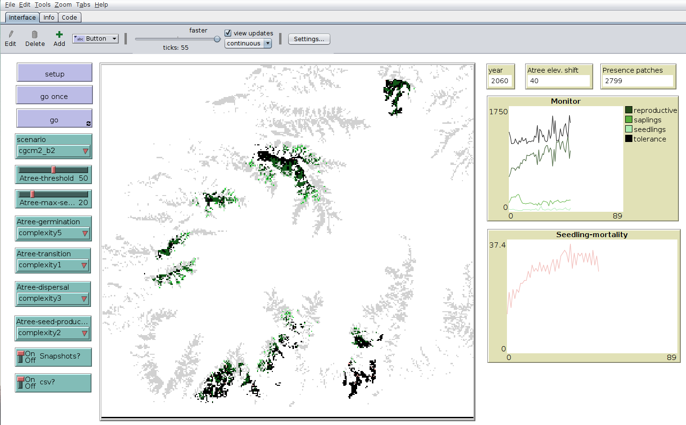

# RangeShiftSimulation

Range shift model coded in NetLogo (https://ccl.northwestern.edu/netlogo/). 
Last NetLogo version known to run this code is 6.0.2.

A demo video can be found here: https://vimeo.com/66052823

The data required to run the simulation can be found here: https://www.dropbox.com/s/zsjja2g3yrgqyl1/data.zip?dl=1 (write me an email to blasbenito (at) gmail.com the link does not work). It is a file named data.zip that should be decompressed in the same folder that contains the code.

The model is provided without documentation, but the code is more or less commented.
